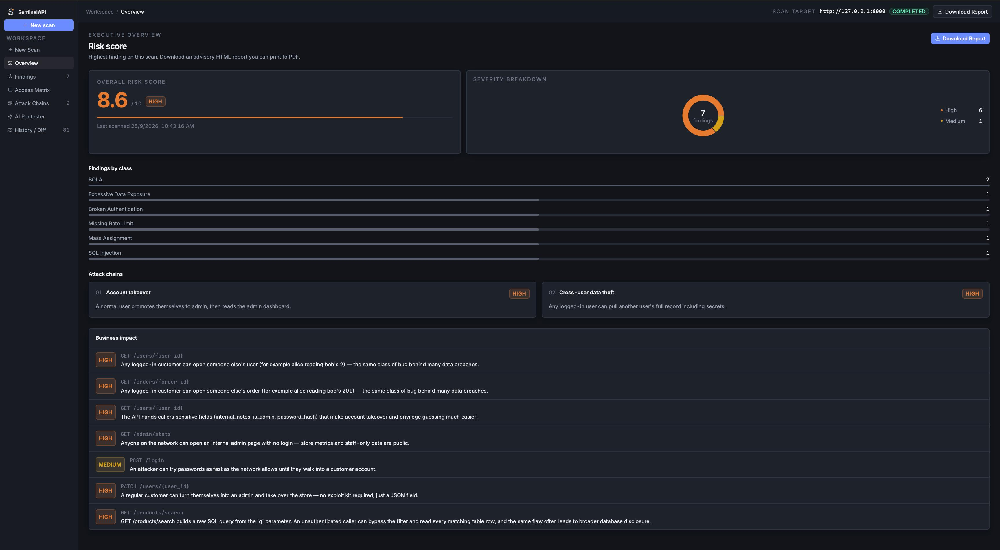
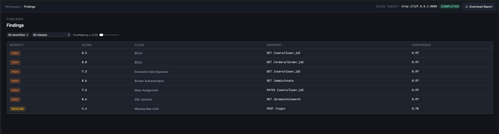
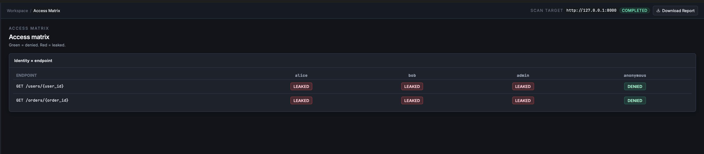
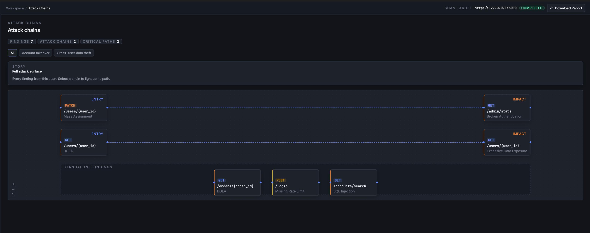
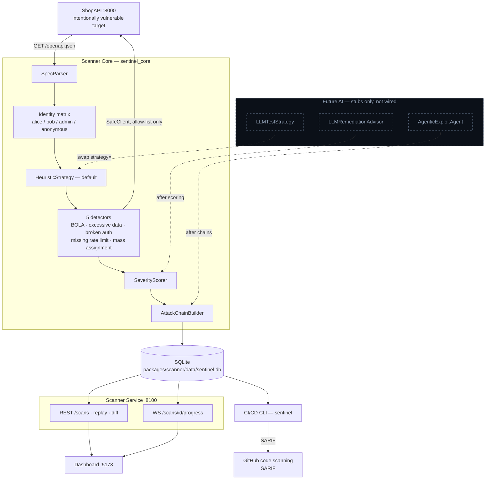

# SentinelAPI

A zero-trust API vulnerability scanner that finds authorization bugs the way
an attacker would — then explains them in language a founder can act on.

Most teams ship APIs with object-level authorization holes (BOLA/IDOR),
broken admin routes, and mass-assignable privilege fields. Those bugs cause
real breaches, but catching them means writing custom tests for every
endpoint and every user. Small teams do not have that time, and generic
scanners miss the identity story.

SentinelAPI ingests an OpenAPI spec, walks an identity matrix (who *should*
see whose objects), and returns severity-ranked findings with a replayable
PoC, a business-impact sentence, and CI that can fail the build.

## What it does

Against the local ShopAPI demo it reports **six findings** and **two attack
chains**:

| Class | What it proves |
| --- | --- |
| BOLA | Alice can read Bob's user and order |
| Excessive data exposure | `password_hash`, `is_admin`, `internal_notes` leak on GET |
| Broken authentication | `/admin/stats` is open to the network |
| Missing rate limit | `POST /login` never returns 429 |
| Mass assignment | A customer can PATCH `is_admin: true` |

On top of the detectors: transparent 0–10 scoring with confidence, attack
chains (account takeover, cross-user data theft), one-click **Replay
attack**, and a `sentinel scan` CI gate that emits SARIF for GitHub.

## Screenshots

Add PNGs under `docs/screenshots/` before the deck goes out.

| View | File |
| --- | --- |
| Executive overview (risk 8.6 + chains) | `docs/screenshots/overview.png` |
| Finding detail + Replay (still vulnerable) | `docs/screenshots/finding-replay.png` |
| Identity Access Matrix | `docs/screenshots/access-matrix.png` |
| Attack Chains graph | `docs/screenshots/attack-chains.png` |









## Architecture

Full write-up: [`docs/architecture.md`](docs/architecture.md).



## Quickstart

**Prerequisites:** Python 3.11+, Node 20+, curl. Nothing is deployed remotely.

```bash
./run.sh --seed
```

`--seed` runs one `sentinel scan` against ShopAPI (`--identities shopapi`,
`--fail-on critical`) so the dashboard is not empty on first load.

| Process | URL |
| --- | --- |
| ShopAPI (target + Swagger) | http://127.0.0.1:8000 · http://127.0.0.1:8000/docs |
| Scanner service | http://127.0.0.1:8100 |
| Dashboard | http://localhost:5173 |

Ctrl+C stops all three. Logs stream from `.run/`.

**Scan from the UI:** New Scan → target `http://127.0.0.1:8000` → identities
`shopapi` → Start scan.

**Scan from the CLI:**

```bash
cd packages/scanner
.venv/bin/sentinel scan \
  --target http://127.0.0.1:8000 \
  --identities shopapi \
  --fail-on high \
  --format table
```

`--fail-on high` exits 1 on ShopAPI (five High findings). `--fail-on critical`
exits 0. SARIF: `--format sarif -o results.sarif` (see
[`docs/ci-example.yml`](docs/ci-example.yml)).

Judge walkthrough: [`docs/demo-script.md`](docs/demo-script.md).

## Why this is not a template scanner

- **Identity matrix** — every object endpoint × alice/bob/admin/anonymous,
  red = leaked, green = denied.
- **One-click Replay** — re-issues the stored PoC through SafeClient and
  shows *still vulnerable*.
- **Attack chains** — findings composed into takeover and data-theft stories.
- **Business-impact layer** — one plain-English sentence per finding.
- **CI/CD SARIF gate** — fail the PR, upload to GitHub code scanning.
- **Diff / regression** — new / fixed / persisting across two scan ids.
- **Transparent scoring** — impact + exploitability factors and a confidence
  score, not a black-box grade.

## Ethics and safety

The scanner **only** talks to hosts on an explicit allow-list (default:
`http://127.0.0.1:8000`). It will not scan production, a teammate's laptop,
or anything you do not own. Safe mode blocks destructive methods (DELETE).
Rate and concurrency caps live in `SafeClient`. ShopAPI is a local demo —
do not expose it to the internet.

## Tech stack and layout

FastAPI + SQLite (ShopAPI and scanner service), `sentinel_core` detectors,
Typer CLI, React + Vite + Tailwind dashboard (Recharts, React Flow).

```
sentinelapi/
├── run.sh
├── docs/                  architecture, demo script, AI roadmap, CI example
├── packages/
│   ├── vulnerable-api/    ShopAPI :8000
│   ├── scanner/           core, service :8100, CLI (`sentinel`)
│   └── dashboard/         ops console :5173
```

Identities preset **`shopapi`**: alice / bob / admin / anonymous, tokens
`tok_alice`, `tok_bob`, `tok_admin`. Shared by the CLI, the service, and
the New Scan form.

## Roadmap

Rule-based today. Typed AI seams (no provider calls) are documented in
[`docs/ai-roadmap.md`](docs/ai-roadmap.md): `LLMTestStrategy`,
`LLMRemediationAdvisor`, `AgenticExploitAgent`.

## Team

Built by **TEAM MUSHU** for AmiHacks.

## License

[MIT](LICENSE).
