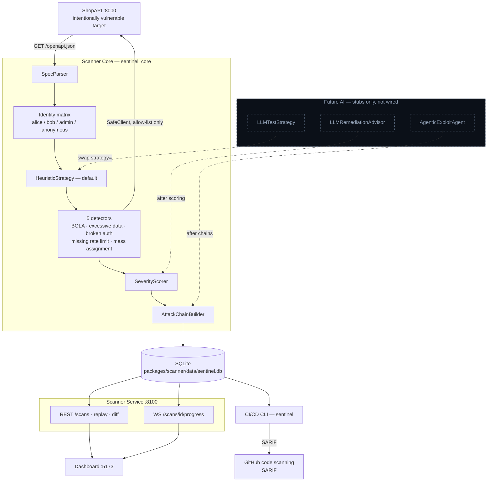

# Architecture

SentinelAPI is a local, allow-listed API vulnerability scanner. ShopAPI is the
only demo target. The rule-based engine is the default; AI modules are typed
stubs and are not on the scan path.

The scanner never crawls the open internet. It fetches ShopAPI's OpenAPI spec,
loads the `shopapi` identity preset (alice, bob, admin, anonymous), and the
default `HeuristicStrategy` lists the same probes the five rule-based detectors
already run. Detectors talk to the target only through `SafeClient` (allow-list,
timeouts, rate cap, safe mode). Findings are scored, linked into two attack
chains (account takeover, cross-user data theft), and written to SQLite. The
service on :8100 streams progress over WebSocket and serves REST to the
dashboard and to `sentinel scan`, which can fail a CI job and emit SARIF for
GitHub. The dotted AI boxes are extension points for later — they raise
`NotImplementedError` today and do not change a scan.
